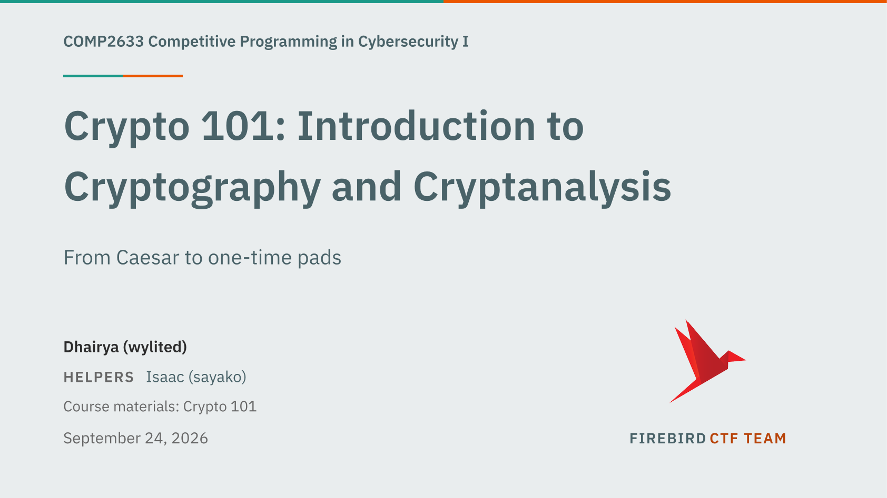

# firebird-slides

Slide deck template for the HKUST Firebird CTF team: 16:9, the team's
teal/orange brand, and the components a CTF lecture needs — callouts, code with
a file bar, terminal sessions, scored challenges, tables, math — built on
[touying](https://touying-typ.github.io/), so overlays, speaker notes and
handout mode come with the slide furniture. It is the Typst counterpart of the
team's Beamer theme.

The repo is the package: decks import it by name
(`@preview/firebird-slides:0.3.0`) and compile with plain `typst compile`,
no flags. [`examples/showcase.typ`](examples/showcase.typ) renders every
component; [`USAGE.md`](USAGE.md) documents them with the rendered slides.



## Quick setup

```sh
git clone --recurse-submodules https://github.com/FirebirdHK/typst
cd typst
pkg="$(typst info 2>&1 | sed -n 's/^[[:space:]]*Package path[[:space:]]*//p')/preview/firebird-slides"
mkdir -p "$pkg" && ln -sfn "$PWD" "$pkg/0.3.0"
```

The submodules bring the BlobCats art (`assets/blobcats/`); an existing clone
catches up with `git submodule update --init`. The link makes the working copy
the package, so edits to `lib.typ` reach every deck on the next compile. If
IBM Plex is not installed system-wide, add `--font-path vendor/fonts` (or set
`TYPST_FONT_PATHS=$PWD/vendor/fonts`) — see [Fonts](#fonts).

## Minimal deck

Copy [`template/main.typ`](template/main.typ), or start from this:

```typ
#import "@preview/firebird-slides:0.3.0": *

#show: firebird.with(
  title: "Elliptic curves without the jargon",
  subtitle: "Why a 256-bit key is not 256 bits of work",
  authors: ("Wyli (wyli)",),
  helpers: ("Robin (mango)",),
)

#title-slide()
#toc-slide()

#section-slide("Groups", subtitle: "The only algebra you need today")

#slide(title: "Claim in the title, evidence in the body")[
  - One idea per line.
  - #strong[Strong] for the phrase you want remembered.
  - Inline math $c = m xor k$ flows inline.
]

#end-slide(lines: ("Next session: ...",))
```

## Compiling

```sh
typst compile deck.typ        # PDF next to the source
typst watch deck.typ          # recompile on save — the authoring loop
```

Works from any directory with no `--root`: the deck imports the package by
name, exactly as an installed package does.

## Configuration

`firebird.with(...)` sets up the whole deck:

| Parameter | Default | Controls |
| --- | --- | --- |
| `title`, `subtitle` | `none` | cover title; `title` also names the deck in metadata |
| `course` | `"COMP2633 …"` | right side of the running header |
| `authors`, `helpers` | `()` | cover lines — presenter(s), then helper(s) |
| `credits` | `()` | short attributions under the helpers on the cover |
| `date` | `auto` | today's date; pass any content to pin it |
| `aspect` | `"16:9"` | or `"4:3"` |
| `body-size` | `19.5pt` | the whole type scale derives from it |
| `sans`, `mono`, `serif` | IBM Plex stacks | font stacks per voice |
| `display` | `"sans"` | `"serif"` moves cover, section and slide titles to the serif voice |
| `raw-theme` | `"assets/firebird.tmTheme"` | syntax-highlighting theme for code |
| `debug`, `gate` | `auto` | same as `--input debug=true` / `gate=true` (see [Verifying](#verifying-your-deck)) |
| `handout` | `false` | collapses every overlay to its final state |

## Overlays

`#pause` splits a slide into subslides; `#uncover(n)`, `#only(n)` and
`#speaker-note[…]` place content per step. `firebird.with(handout: true)`
collapses every overlay to its final state. The header, progress bar and
`n / total` count the slide, never the overlay.

Everything else — `#meanwhile`, slide functions, theming hooks — is touying's;
the [touying documentation](https://touying-typ.github.io/) applies to this
template unchanged.

## Components

| Component | Use |
| --- | --- |
| `slide(body, title:, subtitle:, center:, header:, footer:)` | every content slide |
| `title-slide()`, `toc-slide()`, `section-slide()`, `subsection-slide()`, `end-slide()` | deck furniture |
| `bio-slide(name, discord:, photo:)` | the speaker |
| `admin-slide(items, title:, note:, qr:)` | weekly attendance / exercise / homework schedule |
| `credits-slide(entries, title:, note:)` | attributions |
| `challenge-slide(kind, name, deadline:, links:)` | a scored challenge with its links card |
| `definition`, `exercise`, `claim`, `remark`, `theorem`, `example`, `proof`, `insight`, `warning` | callouts |
| `code(src, lang:, file:, lines:)` | syntax-highlighted code with a file bar |
| `terminal(src, title:)` | a shell session |
| `cols(a, b, ratio:)` | two columns — prose beside code or a figure |
| `keyeq($ … $, note:)` | the one equation that matters, boxed |
| `quote(attribution:)` | serif block quote |
| `data-table(headers, rows, columns:, mono:)` | no-rules table, zebra rows |
| `image-slide()`, `image-row()`, `meme()` | pictures, with captions |
| `inline-code("x")`, `pill[LABEL]` | inline snippet / chip |
| `serif[…]` | the serif voice inline |

Rendered examples of every component: [USAGE.md](USAGE.md).

## Blobcats

The [BlobCats](https://github.com/DuckOfDisorder/BlobCats) pack (Apache-2.0)
is a git submodule at `assets/blobcats/`, and `#blobcat` resolves names
against a committed table — 209 cats, inline on the text baseline or in a
labelled wall:

```typ
Deploy succeeded #blobcat("party")
#blobcat-wall(("party", "sip", "melt", "uwu"), cols: 4, size: 54pt)
```

Names ignore case, spaces, `_` and a leading `BlobCat`; a wrong name fails the
compile with its best guesses, and `#blobcat-list()` renders every name on a
scratch slide.

## Verifying your deck

`--input debug=true` draws the body box and stamps an overflow badge on every
content slide; `--input gate=true` turns the same measurement into a compile
error that names the slide:

```
error: slide 23 [Ciphers] is 19pt taller than its body box — split the slide
or trim it; never shrink the type.
```

The three checks a deck must pass (CI runs them on every push):

```sh
typst compile --input gate=true examples/showcase.typ
typst compile --input gate=true template/main.typ
typst compile tests/contrast.typ
```

Contributing — including what CI does and how the template itself is edited:
[CONTRIBUTING.md](CONTRIBUTING.md).

## Fonts

One type family in three voices, bundled in `vendor/fonts` (SIL OFL) so every
machine renders the deck the same:

| Voice | Family | Used for |
| --- | --- | --- |
| sans | **IBM Plex Sans** | body, titles, callout heads, tables |
| mono | **IBM Plex Mono** | code, terminals, file names |
| serif | **IBM Plex Serif** | block quotes, `#serif[…]` accents |

Typst reads fonts from the system, `--font-path`, and `TYPST_FONT_PATHS` —
pick one:

```sh
typst compile --font-path vendor/fonts deck.typ   # per command
TYPST_FONT_PATHS=$PWD/vendor/fonts typst watch deck.typ
cp vendor/fonts/*/*.ttf ~/Library/Fonts/          # installed once, system-wide
```

Math stays on Typst's New Computer Modern. A missing family falls through to a
platform font — the deck compiles either way. `display: "serif"` moves the
cover, section and slide titles into the serif voice.
